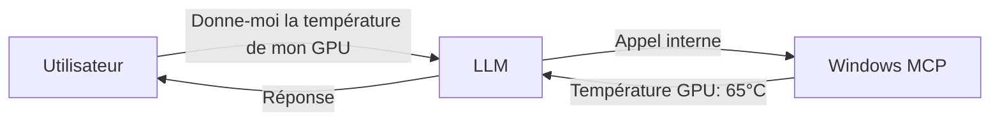

# 🖥️ Windows MCP
**[](LICENSE)**

Un **Micro Command Processor (MCP)** pour **automatiser et contrôler Windows en langage naturel** via un LLM (comme Le Chat).
**Aucun code à écrire** : l’utilisateur demande simplement ce dont il a besoin.

---

## 📋 Description
`windows_mcp` est conçu pour permettre à un **assistant LLM** d’exécuter des tâches système Windows **sans que l’utilisateur ait à coder**.
Exemples de demandes possibles :
- *« Donne-moi la température de mon GPU »*
- *« Crée un fichier sur le bureau avec la liste de mes processus »*
- *« Nettoie les fichiers temporaires de C:\Temp »*
- *« Liste mes jeux Steam installés »*

---

## ✨ Fonctionnalités
| Catégorie               | Exemples de commandes naturelles                          | Fonction interne                     |
|-------------------------|----------------------------------------------------------|--------------------------------------|
| **Monitoring**          | *« Quelle est la température de mon CPU ? »*              | `windows_get_temperatures()`         |
|                         | *« Affiche l’historique d’utilisation du disque »*        | `windows_performance_history()`      |
| **Sécurité**            | *« Vérifie les mises à jour Windows »*                    | `windows_check_updates()`            |
|                         | *« Quel est le statut du UAC ? »*                         | `windows_uac_status()`               |
| **Fichiers**            | *« Trouve les fichiers dupliqués dans mes téléchargements »* | `windows_find_duplicates()`         |
|                         | *« Nettoie les fichiers temporaires »*                    | `windows_clean_temp()`               |
| **Réseau**              | *« Fais un test de vitesse internet »*                    | `windows_speed_test()`               |
|                         | *« Ping google.com 10 fois »*                             | `windows_ping()`                     |
| **Gaming**              | *« Affiche les stats de ma carte graphique »*             | `windows_gpu_stats()`                |
|                         | *« Liste mes jeux Steam »*                                | `windows_steam_games()`              |
| **Automatisation**      | *« Planifie un backup quotidien à 3h »*                   | `windows_create_scheduled_task()`    |

*(Voir [NOUVELLES_FEATURES.md](NOUVELLES_FEATURES.md) pour la liste complète.)*

---

## 🤖 Utilisation avec un LLM
Le MCP est **appelé automatiquement par l’assistant** :



**Exemples concrets** :
- *« Quels sont les processus qui utilisent le plus de CPU ? »*
- *« Crée un fichier C:\temp\processus.txt avec la liste des processus actifs »*
- *« Optimise les performances pour le gaming »*

---

## 🛠️ Installation (pour les admins)
### Prérequis
- Python 3.8+
- PowerShell 5.1+ (pour certaines fonctionnalités)

### Étapes
1. Cloner le dépôt :
   ```bash
   git clone https://github.com/powershelling/windows_mcp.git
   cd windows_mcp
   ```
2. Installer les dépendances :
   ```bash
   pip install -r requirements.txt
   ```
   *(Si `requirements.txt` n’existe pas : `pip install speedtest-cli pywin32`.)*

3. Lancer le serveur MCP :
   ```bash
   python main.py
   ```
   - Le MCP écoute les requêtes du LLM en local.

---

## 📂 Structure du Projet
```
windows_mcp/
├── main.py          # Point d’entrée du serveur MCP
├── server_instance.py # Instance partagée du MCP
├── tools/           # Outils modulaires (automatisation, etc.)
├── utils.py         # Fonctions utilitaires
├── NOUVELLES_FEATURES.md # Détails des fonctionnalités
└── LICENSE          # Licence MIT
```

---

## 📄 Licence
Projet sous licence **MIT** – libre à l’usage, modification et distribution.
*(Voir [LICENSE](LICENSE) pour plus de détails.)*

---

## 🤝 Contribution
Les **pull requests** sont les bienvenues !
Pour signaler un bug ou proposer une feature, ouvrir une **[issue](https://github.com/powershelling/windows_mcp/issues)**.